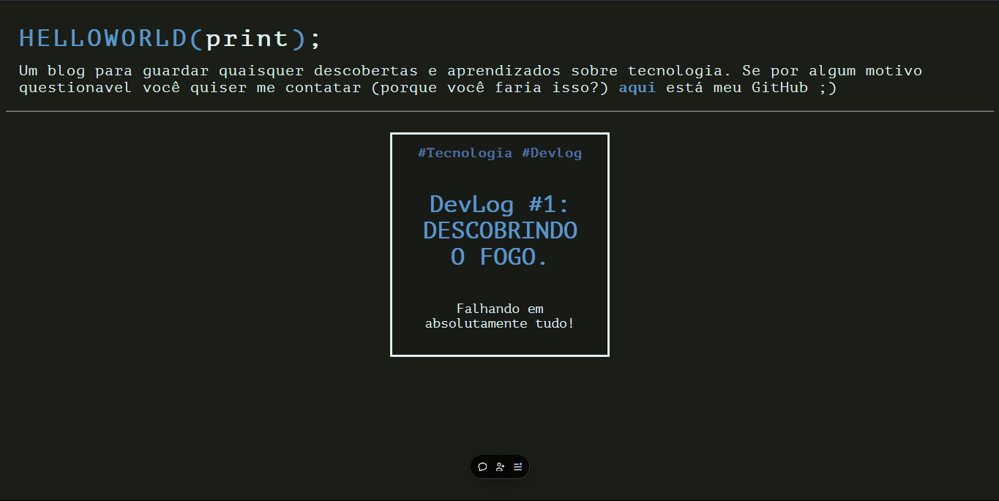
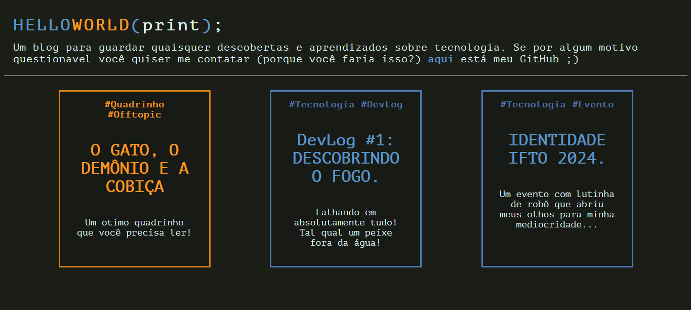
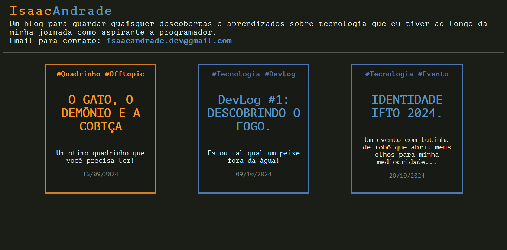

# Isaac Andrade blog
A simple blog to share knowledgement about tech, and especially coding. I made this site with HTML, JavaScript and CSS, all vanilla (for now). 

I want to use my site to explore more about web development, and while i change as a dev, my blog will change too. If you are interessed about the versions, [there is a timeline](#time-line).

# Time-Line
1° Version

My first idea is do a site to post some articles about everything, and i would use my pseudonym "Mandragóra", but quickly i changed my mind LOL

2° Version

Seen this second version you can look how horrible i am when we talk about design. Here i decided to put just "articles" about coding. This name "helloworld(print);" was hilarious, to me...

3° Version (actual)

I put my own name, and now the code is documented, and have a tag search feature# Isaac Andrade blog
A simple blog to share knowledgement about tech, and especially coding. I made this site with HTML, JavaScript and CSS, all vanilla (for now). 

I want to use my site to explore more about web development, and while i change as a dev, my blog will change too. If you are interessed about the versions, [there is a timeline](#time-line).

# Time-Line
1° Version

My first idea is do a site to post some articles about everything, and i would use my pseudonym "Mandragóra", but quickly i changed my mind LOL

2° Version

Seen this second version you can look how horrible i am when we talk about design. Here i decided to put just "articles" about coding. This name "helloworld(print);" was hilarious, to me...

3° Version (actual)

I put my own name, and now the code is documented, and have a tag search feature.